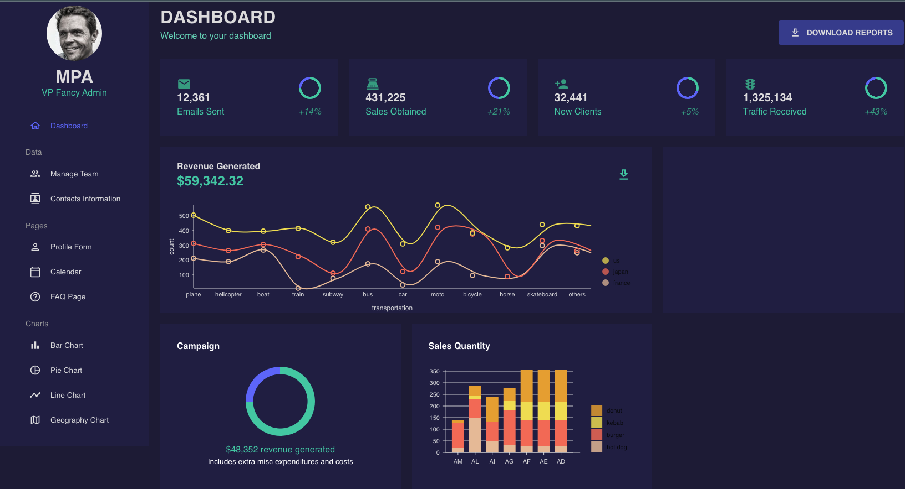

<!-- Project Title -->
<h1 align="center">Material-UI Data Dashboard</h1>

<!-- Project Overview -->

  Welcome to the Material-UI Data Dashboard repository! 🚀

<!-- Project Image/Preview -->

  

<!-- Overview Section -->
## Overview

  This repository hosts a modern and responsive data dashboard developed with <a href="https://material-ui.com/">Material-UI</a>, a React UI framework known for its flexibility and aesthetics. The primary goal of this project is to offer an intuitive and visually appealing interface for displaying and interacting with diverse datasets.

<!-- Features Section -->
## Features

- <strong>Responsive Design:</strong> The dashboard seamlessly adapts to various screen sizes, ensuring a consistent and engaging user experience across devices.
- <strong>Customizable Components:</strong> Utilizing Material-UI's components, you can easily customize and extend the dashboard's charts, tables, and other visualizations.
- <strong>Data Integration:</strong> Effortlessly integrate your own data sources to visualize information in a clear and organized manner.
- <strong>Interactive Elements:</strong> Enhance user engagement with interactive features such as filters, tooltips, and dynamic chart interactions.
